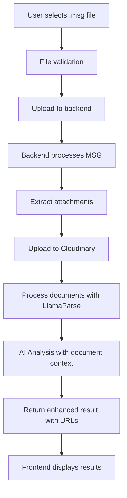
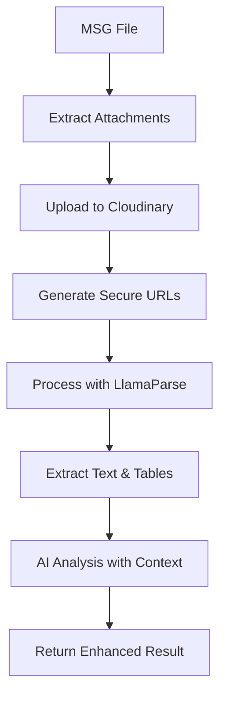

# Enhanced Frontend-Backend Integration Guide

## Overview

This guide describes the complete integration between the frontend and backend for uploading .msg files, processing them with AI analysis, and displaying the results with document rendering capabilities.

## 🚀 Enhanced Features

### 1. **Backend Enhancements**

#### Document Storage & URL Generation
- **Cloudinary Integration**: Automatic upload of attachments to Cloudinary
- **Document URLs**: Generated secure URLs for document access
- **Metadata Tracking**: Complete document metadata with processing status

#### Enhanced Analysis Service
```python
# Backend: Enhanced Analysis Service
class EnhancedAnalysisService:
    def analyze_with_documents(self, email_data, attachments, cloudinary_urls=None):
        # Upload attachments to Cloudinary
        # Process documents with LlamaParse
        # Perform AI analysis with document context
        # Return enhanced result with document URLs
```

#### Response Structure
```json
{
  "email_data": { ... },
  "reinsurance_analysis": { ... },
  "document_metadata": {
    "total_documents": 3,
    "successful_uploads": 3,
    "processed_documents": 2,
    "document_urls": ["https://res.cloudinary.com/...", ...],
    "documents": [
      {
        "id": "doc_1",
        "name": "Policy Application.pdf",
        "url": "https://res.cloudinary.com/...",
        "cloudinary_public_id": "reinsurance_attachments/...",
        "status": "success",
        "size": 2457600,
        "format": "pdf",
        "upload_timestamp": "2024-01-15T10:30:00Z",
        "processing_status": "processed"
      }
    ],
    "processing_summary": { ... }
  },
  "analysis_metadata": {
    "analysis_id": "uuid-here",
    "timestamp": "2024-01-15T10:30:00Z",
    "version": "2.0",
    "enhanced": true,
    "document_integration": true
  }
}
```

### 2. **Frontend Integration**

#### Enhanced File Upload Component
```typescript
// Frontend: Enhanced File Upload with Analysis
const FileUploadZone = ({ onAnalysisComplete, onAnalysisError }) => {
  const analyzeFile = async (file: File) => {
    const result = await apiService.analyzeFile(file, (progress) => {
      setAnalysisProgress(progress);
    });
    
    // Result includes document URLs and metadata
    onAnalysisComplete(result);
  };
};
```

#### Document Rendering Component
```typescript
// Frontend: Document Viewer with Cloudinary URLs
const DocumentViewer = ({ document }) => {
  return (
    <div className="document-viewer">
      <iframe 
        src={document.url} 
        title={document.name}
        className="w-full h-96"
      />
      <div className="document-actions">
        <Button onClick={() => window.open(document.url)}>
          Open in New Tab
        </Button>
        <Button onClick={() => downloadDocument(document)}>
          Download
        </Button>
      </div>
    </div>
  );
};
```

#### Enhanced Analysis Display
```typescript
// Frontend: Comprehensive Analysis Results
const AnalysisResultsDisplay = ({ result }) => {
  const { document_metadata, reinsurance_analysis } = result;
  
  return (
    <div className="space-y-6">
      {/* Document Section */}
      <Card>
        <CardHeader>
          <CardTitle>Attached Documents</CardTitle>
        </CardHeader>
        <CardContent>
          {document_metadata.documents.map(doc => (
            <DocumentCard key={doc.id} document={doc} />
          ))}
        </CardContent>
      </Card>
      
      {/* Analysis Results */}
      <Tabs>
        <TabsContent value="overview">
          <OverviewTab analysis={reinsurance_analysis} />
        </TabsContent>
        <TabsContent value="documents">
          <DocumentsTab documents={document_metadata.documents} />
        </TabsContent>
        <TabsContent value="analysis">
          <AnalysisTab analysis={reinsurance_analysis} />
        </TabsContent>
      </Tabs>
    </div>
  );
};
```

## 🔄 Complete Workflow

### 1. **File Upload Process**


### 2. **Document Processing Pipeline**


## 🎨 UI/UX Enhancements

### Document Display
- **Inline Viewing**: Documents displayed in iframe viewers
- **Download Links**: Direct download from Cloudinary URLs
- **Thumbnail Previews**: Document thumbnails for quick identification
- **Status Indicators**: Processing status for each document

### Analysis Results
- **Tabbed Interface**: Organized display of different analysis aspects
- **Document Integration**: Seamless integration of document viewing
- **Real-time Updates**: Live progress tracking during analysis
- **Export Functionality**: Download analysis results and documents

## 🔧 Technical Implementation

### Backend Configuration
```python
# Environment Variables
CLOUDINARY_CLOUD_NAME=your_cloud_name
CLOUDINARY_API_KEY=your_api_key
CLOUDINARY_API_SECRET=your_api_secret
LLAMA_CLOUD_API_KEY=your_llama_api_key
```

### Frontend Configuration
```typescript
// API Configuration
const API_BASE_URL = 'https://ai-powered-facultative-reinsurancedecisionsupportsystem.replit.app';

// Enhanced API Service
class ApiService {
  async analyzeFile(file: File, onProgress?: Function): Promise<AnalysisResult> {
    // Submit file
    const { task_id } = await this.submitAnalysis(file);
    
    // Poll for completion
    const result = await this.pollTaskStatus(task_id, onProgress);
    
    // Result includes document URLs and metadata
    return result;
  }
}
```

## 📊 Data Flow

### 1. **Upload Flow**
```
Frontend → Backend → Cloudinary → LlamaParse → AI Analysis → Frontend
```

### 2. **Document Access**
```
Frontend → Cloudinary URLs → Document Rendering
```

### 3. **Analysis Display**
```
Backend Result → Frontend Transformation → UI Components
```

## 🚀 Key Benefits

### For Users
- **Seamless Experience**: Upload .msg file and get comprehensive analysis
- **Document Access**: View and download all attached documents
- **Rich Analysis**: AI analysis with document context
- **Beautiful UI**: Professional, organized display of results

### For Developers
- **Modular Architecture**: Clean separation of concerns
- **Scalable Design**: Easy to extend and modify
- **Error Handling**: Comprehensive error handling and fallbacks
- **Type Safety**: Full TypeScript integration

## 🔍 Error Handling

### Backend Errors
- **Upload Failures**: Graceful handling of Cloudinary upload errors
- **Processing Errors**: Fallback processing when LlamaParse fails
- **AI Analysis Errors**: Fallback analysis when AI service fails

### Frontend Errors
- **Network Errors**: Retry logic and user feedback
- **Display Errors**: Graceful degradation of UI components
- **Document Errors**: Fallback display for inaccessible documents

## 📈 Performance Optimizations

### Backend
- **Async Processing**: Non-blocking document processing
- **Caching**: Cloudinary caching for document access
- **Batch Operations**: Efficient batch uploads to Cloudinary

### Frontend
- **Lazy Loading**: Documents loaded on demand
- **Caching**: Local storage for analysis results
- **Optimistic Updates**: UI updates before API confirmation

## 🎯 Future Enhancements

### Planned Features
- **Real-time Collaboration**: Multiple users viewing same analysis
- **Advanced Document Processing**: OCR for scanned documents
- **AI-powered Search**: Search within analysis results
- **Mobile Optimization**: Responsive design for mobile devices

### Integration Opportunities
- **CRM Integration**: Export to customer relationship management
- **Reporting**: Automated report generation
- **Workflow**: Integration with approval workflows
- **Analytics**: Usage analytics and insights

---

This enhanced integration provides a complete, production-ready solution for processing .msg files with comprehensive AI analysis and beautiful document rendering capabilities.
